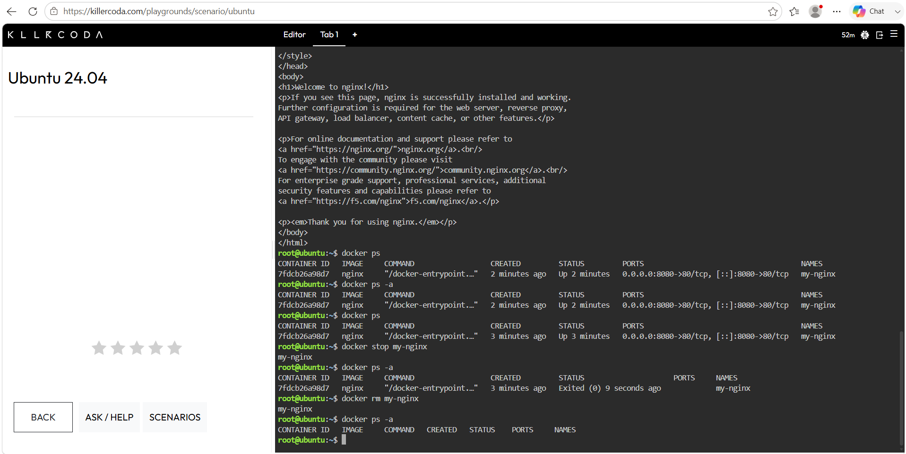

# Docker Deployment Log

## Commands Executed

| Command | What It Did |
|---|---|
| `docker pull nginx` | Downloaded the official Nginx image from Docker Hub |
| `docker run -d -p 8080:80 --name my-nginx nginx` | Ran the Nginx container in detached mode, mapping host port 8080 to container port 80 |
| `curl http://localhost:8080` | Verified the web server was responding by fetching the Nginx welcome page |
| `docker ps` | Listed all currently running containers |
| `docker stop my-nginx` | Stopped the running Nginx container |
| `docker ps -a` | Verified the container's status changed to "Exited" |
| `docker rm my-nginx` | Permanently removed the stopped container |

