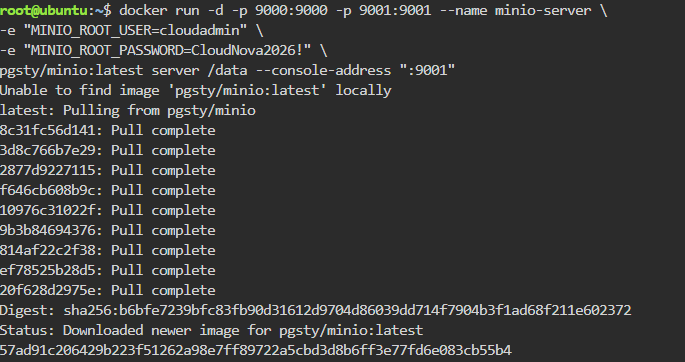
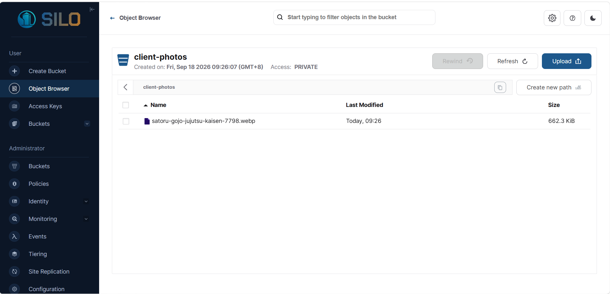

# MinIO Deployment Documentation

## Docker Command Used

    docker run -d -p 9000:9000 -p 9001:9001 --name minio-server \
    -e "MINIO_ROOT_USER=cloudadmin" \
    -e "MINIO_ROOT_PASSWORD=CloudNova2026!" \
    pgsty/minio:latest server /data --console-address ":9001"

**Note:** The official `minio/minio` image failed to pull due to a Docker Hub connectivity issue in the KillerCoda environment. `pgsty/minio:latest`, a mirror of the same MinIO software, was used instead to successfully complete the deployment.

## Access Details

- **Web Console Port:** 9001
- **API Port:** 9000
- **Bucket Created:** client-photos

## Environment Variables Explained

- `MINIO_ROOT_USER`: Sets the admin username used to authenticate into the MinIO web console and API.
- `MINIO_ROOT_PASSWORD`: Sets the admin password paired with the root user, used together with the username to log in securely to the console.

## Verification

Ran `docker ps` after deployment to confirm the container was running successfully:

    CONTAINER ID   IMAGE                COMMAND                  STATUS          PORTS
    57ad91c20642   pgsty/minio:latest   "/usr/bin/docker-ent..."   Up 32 seconds   0.0.0.0:9000-9001->9000-9001/tcp

## Screenshots

