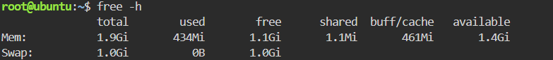

# System Baseline Report

## Host Resources
- **Total RAM:** 1.9Gi
- **Total Storage of root (/):** 19G (5.4G used, 13G available)

## Why Disk Space Matters
Checking disk space before a traffic surge is critical because heavy traffic generates large amounts of logs and cached data, and if the disk fills up, the server can stop writing data or crash even when CPU and memory are healthy.

## Evidence

